<div align="center">

  

  <h1>Veilbox Linux</h1>

  <p><strong>Container-native live distribution · Niri + Noctalia · DevOps-ready</strong></p>

  <p>
    <a href="#-features">
      
    </a>
    <a href="#-included-tooling">
      
    </a>
    <a href="#-specifications">
      
    </a>
    <a href="#-build-from-source">
      
    </a>
    <a href="#-license">
      
    </a>
  </p>

  <p>
    
    
    
    
    
    
  </p>

  <br>

</div>

Veilbox is a live Linux distribution built on Debian Trixie, designed for developers and DevOps practitioners who want a minimal, keyboard-driven Wayland desktop with a full container-native toolchain. It boots directly into the [Niri](https://github.com/niri-wm/niri) scrollable-tiling compositor with the [Noctalia](https://noctalia.dev) shell, Docker, Kubernetes tooling, and cloud CLIs — all on a ~1.7 GB live ISO.

---

## Table of Contents

- [Features](#-features)
- [Specifications](#-specifications)
- [Included Tooling](#-included-tooling)
- [Architecture](#-architecture)
- [Build from Source](#-build-from-source)
- [Usage](#-usage)
- [License](#-license)

---

## Features

| Area | Description |
|---|---|
| **Base OS** | Debian Trixie (13) — stable, wide hardware support, live-build infrastructure |
| **Compositor** | [Niri](https://github.com/niri-wm/niri) — scrollable-tiling Wayland compositor, fluid multi-monitor workflow |
| **Shell** | [Noctalia](https://noctalia.dev) — keyboard-driven desktop shell, auto-launched by niri |
| **Container Runtime** | Docker CE + containerd — pre-installed for immediate container workloads |
| **DevOps Toolchain** | 15+ pre-installed tools: kubectl, Helm, Terraform, Ansible, AWS CLI, GitHub CLI, k9s, stern, kind, and more |
| **Installer** | Calamares graphical installer for permanent installations |
| **Keyboard-driven** | Fuzzel app launcher (Mod+D), foot terminal (Mod+Return), full niri keybindings for window/workspace management |
| **Full Hardware Support** | Debian desktop kernel (i915, amdgpu, nouveau), PipeWire audio, Bluetooth, power management |
| **Auto-Login** | Boots directly into the desktop on tty1; SSH access on ttyS0 for serial debugging |
| **Robust Fallback** | Niri session watchdog restores text-mode console on compositor crash or timeout |

---

## Specifications

| Component | Detail |
|---|---|
| **Base OS** | Debian Trixie (13) — amd64 |
| **Kernel** | `linux-image-amd64` (6.12) — full desktop kernel with all GPU/audio/network drivers |
| **Compositor** | [Niri](https://github.com/niri-wm/niri) 26.04 — community `.deb` from `alexvs159/niri-debian` |
| **Shell** | [Noctalia](https://noctalia.dev) v5 — official APT repo |
| **Launcher** | [Fuzzel](https://codeberg.org/dnkl/fuzzel) — Wayland-native app launcher |
| **Terminal** | [Foot](https://codeberg.org/dnkl/foot) + XTerm — Wayland-native and X11 fallback |
| **Notifications** | [Mako](https://github.com/emersion/mako) — Wayland notification daemon |
| **Audio** | PipeWire + WirePlumber + ALSA compatibility |
| **Clipboard** | wl-clipboard |
| **Screenshots** | grim + slurp |
| **Container** | Docker CE + containerd + Docker Compose plugin |
| **Installer** | Calamares 3.3 (graphical, binary-only on ISO) |
| **Init** | systemd |
| **Bootloader** | ISOLINUX + GRUB (Legacy BIOS + UEFI) |
| **Image Size** | ~1.7 GB, XZ-compressed squashfs |

### Kernel Command Line

```
boot=live components quiet splash console=tty0 console=ttyS0,115200n8
username=veilbox locales=en_US.UTF-8 keyboard-layouts=us timezone=UTC
```

- `console=tty0` ensures a local getty (login prompt) on the laptop display
- `console=ttyS0` enables serial console for headless debugging

---

## Included Tooling

### Container & Orchestration

| Tool | Source | Purpose |
|---|---|---|
| **Docker CE** | `get.docker.com` | Container runtime |
| **Docker Compose** | Docker plugin | Multi-container orchestration |
| **containerd** | Docker bundle | Container runtime daemon |
| **nerdctl** | GitHub Releases | containerd CLI |
| **kubectl** | GitHub Releases | Kubernetes CLI |
| **Helm** | GitHub Releases | Kubernetes package manager |
| **k9s** | GitHub Releases | Kubernetes TUI dashboard |
| **stern** | GitHub Releases | Multi-pod log tailing |
| **kind** | GitHub Releases | Local Kubernetes clusters |
| **kustomize** | GitHub Releases | Kubernetes config management |
| **skopeo** | Debian repo | Container image inspection |

### Infrastructure as Code & Cloud

| Tool | Source | Purpose |
|---|---|---|
| **Terraform** | HashiCorp APT | Infrastructure provisioning |
| **Ansible** | Debian repo | Configuration management |
| **AWS CLI v2** | AWS installer | Amazon Web Services |
| **GitHub CLI** | GitHub APT | GitHub operations |

### Utilities

| Tool | Source | Purpose |
|---|---|---|
| **yq** | GitHub Releases | YAML/JSON processor |
| **dive** | GitHub Releases | Docker layer inspector |
| **jq** | Debian repo | JSON processor |
| **fuzzel** | Debian repo | App launcher |
| **foot** | Debian repo | Wayland terminal |
| **xterm** | Debian repo | X11 terminal (fallback) |
| **mako** | Debian repo | Notification daemon |
| **grim** / **slurp** | Debian repo | Screenshot tools |
| **PipeWire** / **WirePlumber** | Debian repo | Audio |

### Desktop Environment Packages

```
foot xterm fuzzel mako-notifier wl-clipboard grim slurp
pipewire pipewire-pulse wireplumber rtkit
xwayland xserver-xorg-core xserver-xorg-video-all
mesa-utils mesa-vulkan-drivers mesa-va-drivers
fonts-font-awesome fonts-noto fonts-liberation
adwaita-icon-theme papirus-icon-theme
polkit-kde-agent-1 xdg-desktop-portal* spice-vdagent
```

---

## Architecture

```
veilbox/
├── auto/config                 # live-build configuration (kernel cmdline, mirror, packages)
├── build.sh                     # Build wrapper (clean, config, build, qemu)
├── docker-build.sh              # Containerized build wrapper
├── Dockerfile.build            # Builder container (Python + live-build)
├── config/
│   ├── package-lists/           # APT package manifests
│   │   ├── base.list.chroot
│   │   ├── desktop.list.chroot
│   │   ├── devops.list.chroot
│   │   └── live.list.chroot
│   ├── hooks/
│   │   ├── live/                # Runtime chroot hooks
│   │   │   ├── branding.hook.chroot
│   │   │   ├── cleanup.hook.chroot
│   │   │   ├── devops-tools.hook.chroot
│   │   │   ├── docker-install.hook.chroot
│   │   │   ├── noctalia-install.hook.chroot
│   │   │   └── user-setup.hook.chroot
│   │   └── normal/
│   │       └── patch-isolinux-timeout.binary
│   ├── includes.chroot/         # Filesystem overlay (configs, scripts, themes)
│   │   ├── etc/
│   │   │   ├── xdg/niri/        # Niri compositor config
│   │   │   ├── calamares/       # Installer modules
│   │   │   ├── motd             # Message of the day
│   │   │   ├── update-motd.d/   # Dynamic MOTD scripts
│   │   │   ├── skel/            # New user skeleton (.bashrc, .config/)
│   │   │   └── systemd/         # systemd drop-ins (auto-login)
│   │   ├── home/veilbox/        # Pre-created home directory
│   │   ├── usr/local/bin/       # Session launcher, debug script
│   │   └── boot/grub/           # GRUB theme
│   └── includes.binary/         # Binary-stage overlays
├── branding/                    # Logo, wallpaper, GRUB theme sources
├── calamares/                   # Branding module for Calamares
└── output/                      # Build artifacts (veilbox-2.0-amd64.iso)
```

---

## Build from Source

### Prerequisites

- Linux host with `podman` or `docker`
- ~10 GB free disk space
- Network access to Debian mirrors and GitHub/cloud provider releases

### Quick Build

```bash
git clone https://github.com/veilbox/linux.git
cd linux
./docker-build.sh build
```

The ISO is written to `output/veilbox-2.0-amd64.iso`.

### Step-by-Step (Native)

```bash
# Install live-build
sudo apt install live-build

# Configure, clean, and build
./auto/config
sudo lb clean
sudo lb build
```

### Step-by-Step (Containerized)

```bash
# Build the builder container
podman build -t veilbox-builder -f Dockerfile.build .

# Run the build
podman run --rm --privileged \
    -v "$(pwd):/repo:Z" \
    veilbox-builder \
    "cd /repo && ./build.sh all"

# Verify output
ls -lh output/
```

### Build Commands

| Command | Description |
|---|---|
| `./build.sh clean` | Clean build artifacts |
| `./build.sh config` | Re-run `lb config` |
| `./build.sh build` | Build the ISO |
| `./build.sh all` | Clean + config + build |
| `./build.sh qemu` | Boot the ISO in QEMU |

### QEMU Testing

```bash
# Graphical boot
./build.sh qemu

# Serial console boot (debug mode)
qemu-system-x86_64 -m 2048 -smp 2 -enable-kvm \
    -cdrom output/veilbox-2.0-amd64.iso \
    -nographic -display none -serial mon:stdio

# With SSH forwarding
qemu-system-x86_64 -m 2048 -smp 2 -enable-kvm \
    -cdrom output/veilbox-2.0-amd64.iso \
    -netdev user,id=net0,hostfwd=tcp::2224-:22 \
    -device virtio-net,netdev=net0 \
    -nographic -display none -serial mon:stdio
# Then: sshpass -p veilbox ssh -p 2224 veilbox@localhost
```

---

## Usage

### Live Session

The ISO boots to a GRUB menu (auto-selects after 5 seconds). The live session:

1. **Boots** with Plymouth splash and quiet kernel parameters
2. **Auto-logs in** as user `veilbox` on the display (tty1) and serial console (ttyS0)
3. **Starts Niri compositor** via `niri-session` wrapper script
4. **Launches** Noctalia shell, Mako notifications, xwayland-satellite, and foot terminal

### Auto-Login Credentials

| Field | Value |
|---|---|
| Username | `veilbox` |
| Password | `veilbox` |
| sudo | Passwordless (`NOPASSWD: ALL`) |

### Serial Console

The serial console (ttyS0, 115200 baud) provides auto-login and a bash session — useful for headless debugging or VM inspection without a graphical display.

### Desktop Keybindings

| Shortcut | Action |
|---|---|
| Mod+D | Open fuzzel launcher |
| Mod+Return | Open foot terminal |
| Mod+Q | Close focused window |
| Mod+Shift+Q | Quit niri |
| Mod+F | Toggle fullscreen |
| Mod+H / L | Focus column left / right |
| Mod+Left / Right | Focus column left / right |
| Mod+Up / Down | Focus window up / down |
| Mod+Shift+H / L / Left / Right | Move column |
| Mod+1–9 | Switch to workspace 1–9 |
| Mod+Shift+1–9 | Move window to workspace |
| Mod+WheelUp / Down | Focus previous / next workspace |
| Mod+Space | Consume or expand window |
| Mod+Shift+S | Screenshot region |
| Print | Fullscreen screenshot |

### Session Recovery

If Niri crashes or fails to initialize the display, the `niri-session` watchdog:
1. Waits 15 seconds for the Wayland socket to appear
2. On crash: logs the full niri output, restores text console (`chvt 1`)
3. Falls back to an interactive bash login shell

Diagnostic logs are at `/tmp/veilbox/`:
- `session-start.log` — Pre-launch diagnostics (GPU, kernel, dmesg)
- `niri.log` — Niri compositor output
- Run `veilbox-debug` for a summary

### Install to Disk

Run the Calamares installer from the application menu or terminal:

```bash
pkexec calamares -d
```

This provides a graphical guided installation with partitioning, user creation, bootloader setup, and locale configuration.

### Virtual Machine Notes

- **VirtualBox**: Enable EFI, set Graphics Controller to VMSVGA, enable 3D Acceleration, allocate 128 MB video memory
- **QEMU/KVM**: The `spice-vdagent` package is pre-installed for clipboard sharing and display auto-config
- **VMware**: Use VMware SVGA II graphics driver

---

## License

Veilbox is built on Debian GNU/Linux and the Linux kernel. The build scripts, configuration files, and documentation in this repository are licensed under **GNU General Public License v2.0**.

See [`COPYING`](COPYING) for details.

---

<div align="center">
  <sub>Built on Debian Live Build · Kernel 6.12 · Niri · Noctalia · Docker</sub>
</div>
