<div align="center">
  
</div>

Minimal bootable OS — custom kernel, BusyBox, containerd, Dropbear SSH. Boots from a single disk in under 15 seconds.

```
git clone https://github.com/Shreyas0047/veilbox.git
cd veilbox
git lfs pull
./test.sh           # login: root / veiladmin
```

---

I built this because I wanted a minimal container host that boots fast, doesn't need a full distro, and is fun to tinker with. Everything is built from source — kernel, initramfs, disk image.

---

## Quick Start

### Prerequisites

- [Git LFS](https://git-lfs.com/) (for large binary artifacts)
- QEMU (for testing) or VirtualBox (for VM deployment)
- 2 GB RAM for the guest VM

### Clone & Boot

```bash
git clone https://github.com/Shreyas0047/veilbox.git
cd veilbox
git lfs pull                # Fetch pre-built kernel + disk image

# Direct kernel boot (fastest)
./test.sh

# GRUB BIOS boot (full boot path)
./test.sh --bios
```

Boot time: **under 15 seconds** to `veilbox login:` prompt.

### Log In

| Console | Username | Password |
|---------|----------|----------|
| VGA (tty1) / Serial (ttyS0) | `root` | `veiladmin` |
| SSH (port 2222 forwarded) | `root` | key or `veiladmin` |

---

## Features

| Feature | Details |
|---------|---------|
| **Custom Linux kernel** | v7.1.0-rc6, configured for VM and bare metal |
| **Embedded initramfs** | Root filesystem compiled into the kernel binary |
| **BusyBox userspace** | 300+ Unix utilities in a single binary |
| **containerd + runc + nerdctl** | Industry-standard container runtime; `docker` is also available as a nerdctl alias |
| **Dropbear SSH server** | Key-based and password authentication |
| **Dual console** | VGA text (tty1) + serial (ttyS0) |
| **Persistent state** | External ext4 disk mounted at `/mnt/state` |
| **DHCP networking** | Auto-configures via QEMU SLiRP / VirtualBox NAT |
| **Auto-login** | `veilbox.autologin` kernel param for CI workflows |
| **GRUB BIOS boot** | Full boot path for bare-metal or VirtualBox |
| **Rootless build** | Entire build runs without sudo |
| **Bridge networking** | CNI bridge + portmap plugins with NAT for container isolation |
| **AppArmor MAC** | Mandatory Access Control for container process confinement |
| **Seccomp** | Default seccomp profile applied by runc to every container |
| **Rootless containers** | User namespace remapping via /etc/subuid and /etc/subgid |
| **Kernel lockdown** | Lockdown LSM prevents kernel tampering (e.g. /dev/mem, kexec) |
| **Audit logging** | Kernel auditd rules track execve, clone, and mount syscalls |
| **Image verification** | cosign CLI for keyless/signed container image verification |
| **Default resource limits** | nerdctl wrapper injects `--cpus=1 --memory=512m` unless overridden |
| **Kernel hardening** | FORTIFY_SOURCE, YAMA, ASLR entropy increase, DEVMEM/KEXEC/HIBERNATION/PROC_KCORE disabled |
| **Host firewall** | iptables default DROP on INPUT/FORWARD, allow SSH + established |
| **Registry mirror** | containerd configured with docker.io mirror (mirror.gcr.io fallback) |
| **eBPF tracing** | bpftool-based execve tracer logs to syslog (trace-exec.sh) |
| **Health endpoint** | Unix socket HTTP health endpoint at /var/run/health.sock |
| **AppArmor daemon profiles** | Confined profiles for dropbear and containerd daemons |
| **Log rotation** | syslogd capped at 64KB circular buffer via `-s 65536` |
| **NIC bonding** | Kernel bonding driver (`CONFIG_BONDING=y`) for link aggregation and failover |
| **Multi-interface** | Multiple NICs with independent DHCP/static/IP config via `/etc/network/config` |
| **Policy routing** | Per-interface routing tables for multi-homed traffic segregation |
| **WireGuard VPN** | Kernel WireGuard driver for secure site-to-site tunnels |
| **QEMU guest agent** | `qemu-ga` for host-guest communication via virtio-serial |
| **LUKS state encryption** | State disk encrypted with dm-crypt/LUKS; unlocked at boot via embedded keyfile |

---

### Docker CLI Compatibility

The `docker` command is available as a drop-in alias for `nerdctl`. Everything you'd write with `docker` works the same:

```bash
docker run -d --name web -p 8080:80 nginx:alpine
docker ps
docker logs web
docker exec web ls
```

No Docker daemon runs inside the VM. `docker` maps directly to `nerdctl`, which talks to containerd without any extra daemon overhead.

---

## Credentials

| Method | Command |
|--------|---------|
| **SSH key** | `ssh -i output/ssh-test-key root@localhost -p 2222` |
| **SSH password** | `ssh root@localhost -p 2222` (password: `veiladmin`) |

---

## Security

### Defense in Depth

Veilbox implements a layered security model — no single mechanism is relied upon.

| Layer | Mechanism | Scope |
|-------|-----------|-------|
| **Kernel** | AppArmor LSM + seccomp + lockdown + FORTIFY_SOURCE + YAMA | System-wide Mandatory Access Control + hardening |
| **Runtime** | runc applies AppArmor + seccomp | Per-container confinement |
| **Network** | CNI bridge + iptables MASQUERADE + host firewall (DROP default) | Container isolation & NAT |
| **Audit** | Kernel auditd → syslog | Syscall monitoring |
| **Supply chain** | cosign verification | Image authenticity |
| **Resources** | nerdctl defaults (1 CPU, 512MB) | Fair scheduling |
| **Services** | AppArmor profiles for dropbear + containerd daemons | Service confinement |

### AppArmor

AppArmor confines container processes at the kernel level via an LSM. Every container started with `nerdctl` runs under the `docker-default` profile, which restricts access to sensitive filesystems (`/proc`, `/sys`) and blocks common container escape vectors.

The `apparmor_parser` is built from source since Fedora does not ship `apparmor-utils`.

Daemon profiles are also loaded at boot for Dropbear (`usr.sbin.dropbear`) and containerd (`usr.bin.containerd`), confining SSH and container runtime processes respectively.

### Seccomp

The default seccomp profile is applied by containerd/runc to every container. It blocks ~50 syscalls known to be dangerous (e.g. `kexec_load`, `create_module`, `uselib`). The kernel was compiled with `CONFIG_SECCOMP_FILTER=y`.

### Kernel Lockdown

The lockdown LSM (`CONFIG_SECURITY_LOCKDOWN_LSM`) is compiled into the kernel. When integrity mode is active, it prevents userspace from tampering with kernel memory (`/dev/mem`), loading unsigned modules, and using kexec/kdbus.

### Runtime Kernel Hardening

Kernel sysctls are applied at boot via rcS:

| Sysctl | Value | Purpose |
|--------|-------|---------|
| `kernel.kptr_restrict` | 2 | Hide kernel pointers from unprivileged users |
| `kernel.dmesg_restrict` | 1 | Restrict dmesg output to root (CAP\_SYSLOG) |
| `net.ipv4.conf.all.rp_filter` | 1 | Reverse path filtering (anti-spoofing) |
| `net.ipv4.conf.all.accept\_source\_route` | 0 | Disable source-routed packets |
| `net.ipv4.tcp\_syncookies` | 1 | SYN flood protection |
| `vm.mmap\_rnd\_bits` | 32 | Maximum ASLR entropy for mmap base |

### Module Signing

All kernel modules are signed during the build with an ephemeral key (`CONFIG_MODULE_SIG_FORCE=y`). Unsigned modules will not load — even by root.

### Rootless Containers

User namespace remapping is configured in `/etc/subuid` and `/etc/subgid` (65536 subordinate IDs for root). Containers can run with reduced privileges, mapping the container's root UID to an unprivileged host UID.

### Audit Logging

Kernel audit rules are set at boot via `/etc/audit/rules.d/container.rules`:
- `execve` — track all binary executions
- `clone` / `fork` — track process creation
- `mount` — track filesystem mounts
- Container breakouts trigger events logged via syslogd

### Supply Chain Security

`cosign` is installed in the VM for verifying container image signatures:

```bash
cosign verify --key <pubkey> <image>
cosign verify --insecure-ignore-tlog <image>  # keyless mode
```

### Default Resource Limits

The `nerdctl` binary is wrapped in a shell script that injects `--cpus=1` and `--memory=512m` on `run`/`create` commands unless the user explicitly overrides them:

```bash
# These get defaults applied
nerdctl run nginx:alpine              # → 1 CPU, 512MB
nerdctl run --cpus=4 nginx:alpine     # → 4 CPU, 512MB (partial override)
nerdctl run --memory=2g nginx:alpine  # → 1 CPU, 2G (partial override)
```

### Bridge Networking

Containers use a virtual bridge (`cni0`) instead of the host network namespace. The default CNI config allocates each container an IP on `10.88.0.0/16` and sets up iptables NAT for external traffic.

```bash
# Inside the VM
nerdctl run -d --name web nginx:alpine
nerdctl run -d --name app -p 8080:80 nginx:alpine
```

Port mapping (`-p 8080:80`) uses the CNI portmap plugin.

### Multi-Interface & Bonding

Veilbox supports multiple NICs, interface bonding, and policy routing via `/etc/network/config` and the `/sbin/net-init` boot script.

**Default config** (single interface, DHCP — backward compatible):
```bash
IFACES="eth0"
eth0_MODE="dhcp"
```

**Testing with two NICs:**
```bash
./test.sh --second-nic
# Inside the VM, you'll see eth1 with IP 192.168.100.100
```

**Static IP example:**
```bash
IFACES="eth0"
eth0_MODE="static"
eth0_IP="192.168.1.100/24"
eth0_GW="192.168.1.1"
```

**NIC bonding (802.3ad):**
```bash
IFACES="bond0"
bond0_MODE="dhcp"
bond0_BOND_SLAVES="eth0 eth1"
bond0_BOND_OPTS="mode=802.3ad miimon=100 lacp_rate=fast"
```

**Active-backup failover:**
```bash
IFACES="bond0"
bond0_MODE="static"
bond0_IP="192.168.1.100/24"
bond0_GW="192.168.1.1"
bond0_BOND_SLAVES="eth0 eth1"
bond0_BOND_OPTS="mode=active-backup miimon=100 primary=eth0"
```

**Policy routing (multi-homed traffic):**
```bash
IFACES="eth0 eth1"
eth0_MODE="dhcp"
eth1_MODE="static"
eth1_IP="192.168.100.10/24"
eth1_GW="192.168.100.1"

RULES="eth1"
eth1_TABLE="100"
eth1_ROUTES="192.168.200.0/24 192.168.100.1"
```

The iptables MASQUERADE rule detects the default route interface dynamically, so NAT works regardless of which interface provides the default gateway.

### WireGuard VPN

Veilbox includes the kernel WireGuard driver (`CONFIG_WIREGUARD=y`) and the `wg` command-line tool for secure site-to-site VPN tunnels.

```bash
# Create a WireGuard interface
ip link add dev wg0 type wireguard
wg setconf wg0 /etc/wireguard/wg0.conf
ip link set wg0 up
ip addr add 10.0.0.2/24 dev wg0

# Show connection status
wg show
```

The WireGuard driver is compiled into the kernel (not a module) so it's available without any module loading.

### QEMU Guest Agent

The QEMU guest agent (`qemu-ga`) provides a communication channel between the host and the Veilbox VM over virtio-serial. It is started automatically at boot when a virtio-serial device is present.

```bash
# On the host, send commands to the guest
echo '{"execute":"guest-ping"}' | sudo socat - UNIX-CONNECT:/tmp/qga.sock

# Guest network info
echo '{"execute":"guest-network-get-interfaces"}' | sudo socat - UNIX-CONNECT:/tmp/qga.sock
```

The test.sh runner includes a virtio-serial device by default, so `qemu-ga` is available in every QEMU session. A Unix socket at `/tmp/qga.sock` on the host provides access to the guest agent.

### LUKS State Encryption

The persistent state disk (`state.img`) is encrypted with LUKS (dm-crypt) during the build. A random 32-byte key is embedded in the kernel's initramfs (`/etc/state.key`, root-only access). At boot, the keyfile unlocks the state disk automatically.

**Security model**: The state data is encrypted at rest on disk. An attacker who steals only the disk image cannot decrypt the containerd data, logs, or container volumes without also having the kernel binary (which contains the keyfile in its embedded initramfs).

```bash
# Use the LUKS-encrypted state disk (creates from pre-built state.img)
./test.sh --keep-state

# The state.img is encrypted during build; no user intervention needed at boot
# To change the passphrase (for additional protection):
# cryptsetup luksChangeKey /path/to/state.img
```

If `cryptsetup` is not available on the build host, the state image falls back to plain ext4 (backward compatible).

### Secure Mount

The state disk is remounted at boot with `noexec,nodev,nosuid` to prevent execution of untrusted binaries from the persistent volume.

### Stack

| Layer | Mechanism |
|-------|-----------|
| **Kernel** | AppArmor LSM + seccomp + lockdown + module signing |
| **Runtime** | runc applies AppArmor + seccomp profiles |
| **Container** | Process confined by MAC + seccomp + user namespace |
| **Network** | Bridge isolation + iptables NAT + portmap |
| **Audit** | Kernel auditd → syslog → container.rules |
| **Resources** | nerdctl wrapper injects default --cpus / --memory |

```bash
# Direct kernel boot (default, fastest)
./test.sh

# Full GRUB BIOS boot path
./test.sh --bios

# Auto-login for automated workflows
./test.sh --autologin

# Persistent state disk
./test.sh --keep-state

# Health check (exit 0 if booted)
./test.sh --check

# Custom RAM
MEM=4G ./test.sh

# To exit QEMU: Ctrl-A, then X (inside VM: shutdown)
```

---

## VirtualBox

```bash
# One-command setup and boot (creates VM, configures, starts)
./test.sh --vbox

# Register VM without starting
./test.sh --vbox-create

# Custom name / port
VM_NAME=veilbox SSH_PORT=2223 ./test.sh --vbox
```

**Manual setup:**
1. New VM → Name: `veilbox` → Type: `Linux` → Version: `Other Linux (64-bit)`
2. Memory: **2048 MB** (2 GB minimum)
3. Hard disk: *"Use an existing virtual hard disk file"* → `output/veilbox.vdi`
4. Settings → Network → Advanced → Port Forwarding → Add:
   - Host `2222` → Guest `22` (SSH)
   - Host `8080` → Guest `8080` (web containers)
5. Start the VM

SSH in: `ssh -i output/ssh-test-key root@localhost -p 2222`

---

## Web Container Access

Port `8080` on your host is forwarded to port `8080` inside the VM (customize with `WEB_PORT=9090 ./test.sh`).

**Run a web server:**
```bash
# Inside the VM
nerdctl pull nginx:alpine
nerdctl run -d --name web -p 8080:80 nginx:alpine
```

Then visit **http://localhost:8080/** from your host browser.

**Custom port:**
```bash
# Host terminal
WEB_PORT=3000 ./test.sh

# Inside VM
nerdctl run -d -p 3000:80 nginx:alpine
```

---

## Host Your Own Website

### Option A — Volume mount (quick, no build)
```bash
# Transfer your site to the VM
scp -P 2222 -r /path/to/website root@localhost:/mnt/state/site

# Inside the VM, serve with nginx
nerdctl pull nginx:alpine
nerdctl run -d --name website \
  --network host \
  -v /mnt/state/site:/usr/share/nginx/html:ro \
  nginx:alpine

# Update files anytime — changes are live instantly
scp -P 2222 new-index.html root@localhost:/mnt/state/site/
```

Visit **http://localhost:8080/** (or the `WEB_PORT` you set).

### Option B — Node.js app (containerized)
Apps with a backend (Express, Next.js, etc.) need Node.js:

```bash
# Transfer your app to the VM
scp -P 2222 -r /path/to/node-app root@localhost:/mnt/state/myapp

# Inside the VM, run it
nerdctl run -d --name myapp \
  --network host \
  -e PORT=8080 \
  -v /mnt/state/myapp:/app:ro \
  -w /app \
  node:26-slim \
  node server.js
```

**Why `--network host`?** The VM uses QEMU user-mode networking which doesn't support kernel bridge operations. `--network host` lets the container bind directly to the VM's network stack, and `-e PORT=8080` makes the app listen on the pre-forwarded port.

### Option C — Build a custom image (requires BuildKit)
If you've added BuildKit to the VM (see build.sh), you can build reusable images:

```dockerfile
FROM node:26-slim AS builder
WORKDIR /app
COPY package*.json ./
RUN apt-get update && apt-get install -y python3 make g++ && \
    npm ci --only=production && apt-get clean

FROM node:26-slim
WORKDIR /app
COPY --from=builder /app/node_modules ./node_modules
COPY . .
EXPOSE 3000
CMD ["node", "server.js"]
```

```bash
nerdctl build -t myapp:latest /mnt/state/myapp
nerdctl run -d --name myapp --network host -e PORT=8080 myapp:latest
```

---

## Build from Source

The entire OS can be built from source with no sudo required:

```bash
# Full build (≈5 min)
./build.sh

# Clean rebuild
./build.sh --clean

# Boot after build
MEM=2G ./test.sh
```

### Build Artifacts

| Artifact | Size | Description |
|----------|------|-------------|
| `output/vmlinuz` | 73 MB | bzImage kernel with embedded initramfs (LFS) |
| `output/veilbox.raw` | 8 GB | Raw disk image (GRUB + kernel + state) |
| `output/veilbox.vdi` | 95 MB | VirtualBox sparse disk image (LFS) |
| `output/ssh-test-key` | 400 B | ED25519 SSH private key (LFS) |

### Build Requirements

| Dependency | Version | Package (Fedora) |
|-----------|---------|------------------|
| GCC | 16+ | `gcc gcc-c++` |
| GNU Make | 4.x | `make` |
| QEMU | 10.x | `qemu-system-x86` |
| GRUB tools | 2.x | `grub2-tools` |
| CPIO | 2.13+ | `cpio` |
| Bison + Flex | 3.x / 2.6+ | `bison flex` (for AppArmor source build) |
| iptables | 1.8+ | `iptables-legacy` |

---

## Docker Build

The entire build can run inside a container, no host dependencies required:

```bash
# Build the builder image (one-time)
docker build -t veilbox-builder .

# Build Veilbox (output lands in output/ on your host)
docker run --rm -v "$(pwd):/build" -w /build veilbox-builder ./build.sh
```

To extract build artifacts without a volume mount (multi-stage output):

```bash
docker build --output=output/ .
```

### How it works

The [`Dockerfile`](Dockerfile) starts from `fedora:latest` and installs all build dependencies (kernel toolchain, GRUB, QEMU, cryptsetup, SquashFS tools, etc.). The source tree is mounted at runtime so no `COPY` is needed — keeping the Docker image small and avoiding the multi-gigabyte kernel source in the build context.

---

## Build Guide

A **152-page LaTeX technical reference** is included:

**`veilbox-guide.pdf`** covers the complete system:

| Chapter | Topics |
|---------|--------|
| 1–2 | Overview, System Architecture (8-layer model) |
| 3–5 | Prerequisites, Build Pipeline, Kernel Configuration |
| 6–8 | GRUB Bootloader, Initramfs, Boot Process |
| 9–11 | QEMU Virtualization, Services, Troubleshooting |
| 12–15 | Kernel Build System, BusyBox, Init, Containerd |
| 16–19 | Dropbear SSH, Bridge Networking, AppArmor, Audit, Lockdown |
| 20–22 | Performance Tuning, Container Workloads, Comparisons |
| 23–24 | Tutorials, Quick Reference |
| 25 | Appendix — Full source code listings |

```bash
open veilbox-guide.pdf    # macOS
xdg-open veilbox-guide.pdf # Linux
```

---

## Repository Structure

```
veilbox/
├── Dockerfile                # Containerized build (see Docker Build section)
├── build.sh                  # Build pipeline (14 stages)
├── test.sh                   # QEMU / VirtualBox test runner
├── CONTRIBUTING.md           # Contributor guide
├── README.md                 # This file
├── .gitignore                # Excludes kernel source & build artifacts
├── .gitattributes            # Git LFS for large binaries
├── veilbox-guide.tex         # LaTeX source for the build guide
├── veilbox-guide.pdf         # 152-page technical reference
├── kernel/
│   └── configs/
│       └── custom-os.config  # Kernel config (130+ security/networking options)
├── rootfs/                   # Initramfs source tree
│   ├── bin/                  # Symlinks to BusyBox
│   ├── sbin/                 # System utilities, auditctl, iptables, apparmor_parser, net-init
│   ├── etc/                  # Configuration (inittab, rcS, passwd, subuid, subgid, audit/)
│   │   ├── apparmor.d/       # AppArmor profiles (docker-default, usr.sbin.dropbear, usr.bin.containerd)
│   │   ├── containerd/       # containerd config (registry mirror, SystemdCgroup=false)
│   │   ├── network/          # Network interface config (multi-if, bonding, policy routing)
│   │   └── nerdctl/          # nerdctl config (cgroupfs, pull_mode)
│   ├── opt/cni/bin/          # CNI plugins (bridge, host-local, loopback, portmap, firewall)
│   ├── root/                 # Root profile with colored prompt
│   └── usr/
│       ├── bin/
│       │   ├── trace-exec.sh # eBPF execve tracer (logs to syslog)
│       │   └── health.sh     # Unix socket HTTP health endpoint
│       └── share/udhcpc/     # DHCP client script
├── chapters/                 # LaTeX chapter source files (25 chapters)
├── output/                   # Build artifacts (LFS tracked)
│   ├── vmlinuz               # Pre-built kernel (~73 MB)
│   ├── veilbox.vdi           # VirtualBox disk image (~95 MB)
│   └── ssh-test-key          # SSH identity key
└── docs/                     # GitHub Pages website
```

**Note:** Only source files are committed. Binaries (containerd, nerdctl, runc, dropbear, BusyBox, shared libraries) are downloaded by `build.sh` at build time. Pre-built artifacts are distributed via Git LFS.

---

## Contributing

See [CONTRIBUTING.md](CONTRIBUTING.md) for guidelines on setting up a development environment, coding standards, and the PR process.

---

## License

[GNU General Public License v2](https://www.gnu.org/licenses/old-licenses/gpl-2.0.html)

---

Built for learning and lab environments. [GitHub](https://github.com/Shreyas0047/veilbox) · [Website](https://shreyas0047.github.io/veilbox)
